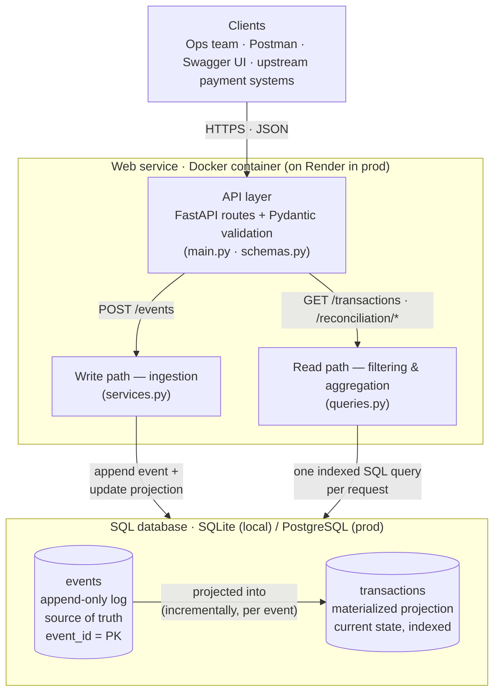
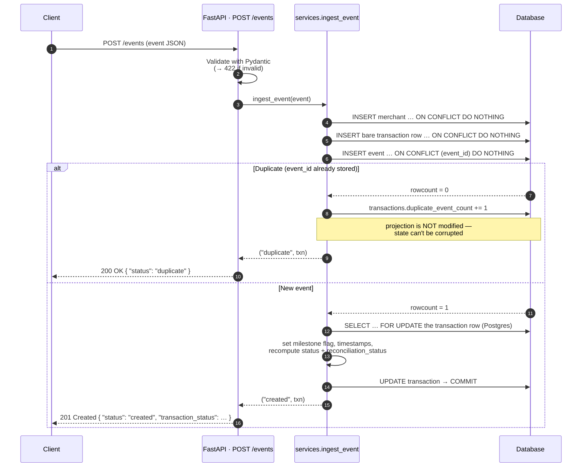
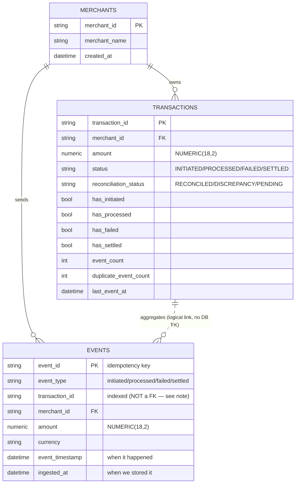
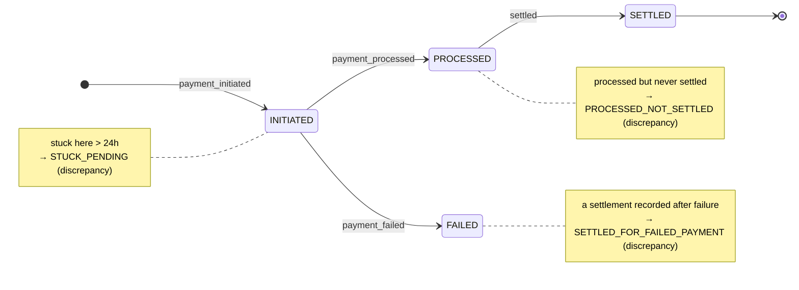

# Setu — Payment Reconciliation Service

A lightweight backend that ingests payment **lifecycle events**, keeps each
transaction's **current state** up to date, and answers the questions an operations
team actually asks: *which payments are stuck? what got settled that shouldn't have?
how much settled per merchant, per day?*

Built with **FastAPI + SQLAlchemy 2.0**. It runs on **SQLite** locally (zero setup)
and **PostgreSQL** in production — the *same* code, switched by a single environment
variable.

- **Live demo:** https://setu-reconciliation.onrender.com &nbsp;·&nbsp; **Interactive API docs:** https://setu-reconciliation.onrender.com/docs
  <br/><sub>(Free tier sleeps when idle — the first request can take ~50s to wake it, then it's fast. Hit `/health` once to warm it up.)</sub>
- **Postman collection:** [`postman_collection.json`](./postman_collection.json) — `base_url` is already pointed at the live demo.
- **Demo video:** _<add your Loom/Drive walkthrough link here>_

---

## How it works in 60 seconds

Payment systems emit events like `payment_initiated`, `payment_processed`,
`payment_failed`, and `settled`. This service:

1. **Ingests** those events at `POST /events`. Every event is stored forever in an
   **append-only log**, and ingestion is **idempotent** — sending the same event
   twice never double-counts or corrupts anything.
2. **Maintains** a `transactions` table that is the *current state* of each payment,
   updated the moment each event arrives.
3. **Exposes read APIs** for the ops team: list/search transactions, drill into one
   transaction's full history, get reconciliation summaries, and — the important
   one — **surface discrepancies** (e.g. money that was processed but never settled,
   or settlements recorded against failed payments).

The design in one line: **an append-only event log is the source of truth, and a
materialized `transactions` projection makes every query a single, fast, indexed
SQL statement.**

---

## Table of contents

- [Quick start (local, < 2 minutes)](#quick-start-local--2-minutes)
- [Architecture](#architecture)
  - [System overview](#system-overview)
  - [The write path — idempotent ingestion](#the-write-path--idempotent-ingestion)
  - [The read path — everything in SQL](#the-read-path--everything-in-sql)
  - [Data model](#data-model)
  - [Transaction lifecycle & reconciliation](#transaction-lifecycle--reconciliation)
  - [Indexes (and proof they're used)](#indexes-and-proof-theyre-used)
- [API documentation](#api-documentation)
- [Sample data](#sample-data)
- [Deployment](#deployment)
- [Testing](#testing)
- [Assumptions & tradeoffs](#assumptions--tradeoffs)
- [Project layout](#project-layout)
- [AI tools disclosure](#ai-tools-disclosure)

---

## Quick start (local, < 2 minutes)

No database to install — it defaults to a local SQLite file.

```bash
cd solutions-engineer
python -m venv .venv
# Windows:  .venv\Scripts\activate      |  macOS/Linux: source .venv/bin/activate
pip install -r requirements.txt

# 1) Seed the ~10k sample events (idempotent, ~15–20s)
python -m scripts.load_sample_data

# 2) Run the service
uvicorn app.main:app --reload
```

Now open <http://localhost:8000/docs> for the interactive Swagger UI, or import
[`postman_collection.json`](./postman_collection.json) into Postman (set the
`base_url` variable to `http://localhost:8000`).

<details>
<summary><b>Prefer Postgres locally? (production-faithful, needs Docker)</b></summary>

```bash
docker compose up --build        # starts Postgres + the API on :8000
docker compose exec api python -m scripts.load_sample_data
```
</details>

Run the test suite:

```bash
pytest -q      # 22 tests
```

---

## Architecture

### System overview



**The whole service in three layers:** a thin **API layer** (routing + validation),
a **write path** that turns incoming events into durable state, and a **read path**
that answers queries. They meet at one SQL database whose flavour (SQLite vs
Postgres) is the only thing that changes between local and production.

**Why two tables instead of one?**

- The **`events` log** preserves complete history (a requirement) and is the
  **idempotency boundary**: `event_id` is its primary key, so a resubmitted event
  collides and is silently dropped *by the database* — not by an application-level
  "have I seen this?" check that can race under concurrency.
- The **`transactions` projection** is what every read API queries. Because each
  transaction's current status, per-milestone flags, and timestamps are already
  computed and indexed, listing, filtering, sorting, paginating, and *all*
  reconciliation aggregation run as **single indexed SQL queries — no Python loops,
  no N+1**. A `merchant × status` summary over 3,800 transactions returns in ~10 ms
  locally.

The projection is updated **incrementally** on every new event (O(1) per event):
flip the relevant boolean flag, refresh timestamps, and recompute the derived
statuses. Because it works off flags rather than a strict sequence, updates are
**order-independent** — a `settled` event that somehow arrives before its
`payment_initiated` still converges to the correct final state.

### The write path — idempotent ingestion

This is the heart of the service. Every `POST /events` follows the same path, and
duplicates are handled by the database itself:



Three things worth calling out:

1. **Idempotency is enforced by the DB, not by Python.** `event_id` is a primary
   key; `INSERT … ON CONFLICT DO NOTHING` returns `rowcount = 0` for a duplicate. On
   a duplicate we only bump a counter (for reporting) and leave the projection
   untouched — so replays never double-count amounts or corrupt state.
2. **It's concurrency-safe.** Before locking, we `INSERT … ON CONFLICT DO NOTHING`
   a *bare* transaction row, so two simultaneous *first* events for the same new
   transaction can't both try to create it (which would 500). They then serialize on
   a `SELECT … FOR UPDATE` row lock. (FastAPI runs sync endpoints in a threadpool,
   so this genuinely races even on a single worker — hence the care.)
3. **It's dialect-aware.** The `ON CONFLICT` construct is generated for whichever
   database is connected (SQLite or Postgres), from one code path.

### The read path — everything in SQL

Every read endpoint hits the pre-computed `transactions` projection with **one
indexed query**. Nothing is filtered, counted, or aggregated in Python:

- **List** (`GET /transactions`) — `WHERE` clauses on indexed columns + `ORDER BY` +
  `LIMIT/OFFSET`, with the total from a SQL `COUNT`.
- **Summary** (`GET /reconciliation/summary`) — a single `GROUP BY` with conditional
  aggregates (`SUM(CASE WHEN status = … )`) to get per-status counts and exact
  `SUM(amount)` in one scan.
- **Discrepancies** (`GET /reconciliation/discrepancies`) — each discrepancy type is
  a small, indexable boolean predicate over the flag columns (see
  [the table below](#get-reconciliationdiscrepancies--inconsistent-transactions)).

### Data model



| Table | Purpose | Key columns |
|---|---|---|
| `merchants` | Merchant registry | `merchant_id` (PK), `merchant_name` |
| `events` | Append-only event history | `event_id` (**PK → idempotency**), `event_type`, `transaction_id` (indexed), `merchant_id` (FK), `amount`, `currency`, `event_timestamp`, `ingested_at` |
| `transactions` | Materialized current state | `transaction_id` (PK), `merchant_id` (FK), `amount`, `status`, `reconciliation_status`, `has_initiated/processed/failed/settled`, `*_at` timestamps, `event_count`, `duplicate_event_count` |

> **Note on the `events.transaction_id` link.** It is intentionally **not** a
> database foreign key. `transactions` is *derived from* `events`, so making events
> depend on a transactions row existing first would invert the relationship — and
> under an enforced FK (Postgres) it breaks ingestion outright. It's a plain,
> **indexed** column instead; the relationship is logical, not enforced.

**Two independent state dimensions.** Instead of forcing events into one rigid
linear state machine, each transaction tracks *payment* and *settlement*
independently via boolean flags (`has_processed`, `has_settled`, …). This mirrors
reality — payment capture and fund settlement are separate systems — and turns every
discrepancy into a trivial, indexable SQL predicate.

**Money is `NUMERIC(18,2)`, never `FLOAT`.** Binary floats can't represent decimal
currency exactly (`0.1 + 0.2 ≠ 0.3`) — unacceptable for a payments service. `NUMERIC`
gives exact storage and an exact SQL `SUM`. (SQLite has no native decimal type so it
approximates; production runs on Postgres, where it's exact.)

### Transaction lifecycle & reconciliation

Events drive each transaction through its lifecycle. The derived `status` is the
"furthest" milestone reached (precedence `SETTLED > FAILED > PROCESSED > INITIATED`);
discrepancies are where the payment and settlement dimensions disagree:



Alongside `status`, each transaction also stores a materialized
**`reconciliation_status`** so ops can filter directly
(`GET /transactions?reconciliation_status=DISCREPANCY`):

- **`RECONCILED`** — a clean terminal state (settled success, or a clean failure).
- **`DISCREPANCY`** — payment and settlement states are inconsistent.
- **`PENDING`** — still in flight.

On the sample data that works out to **RECONCILED 3,135 · DISCREPANCY 475 · PENDING 190**.

### Indexes (and proof they're used)

| Index | Serves |
|---|---|
| `events(event_id)` (PK) | Idempotent ingestion |
| `events(transaction_id, event_timestamp)` | Event history on the detail endpoint |
| `transactions(merchant_id)`, `(status)`, `(merchant_id, status)` | `GET /transactions` filters |
| `transactions(reconciliation_status)` | Reconciliation-status filter |
| `transactions(last_event_at)` | Date-range filter + default sort |
| `transactions(has_processed, has_settled, has_failed)` | Discrepancy scans |

These aren't decorative — `EXPLAIN QUERY PLAN` on SQLite confirms each one is used
(Postgres picks equivalent index scans):

```text
-- WHERE status='SETTLED' ORDER BY last_event_at DESC LIMIT 50
SEARCH transactions USING INDEX ix_txn_status (status=?)

-- WHERE merchant_id='merchant_1' AND status='SETTLED'
SEARCH transactions USING INDEX ix_txn_merchant_status (merchant_id=? AND status=?)

-- WHERE reconciliation_status='DISCREPANCY'
SEARCH transactions USING INDEX ix_txn_recon_status (reconciliation_status=?)
```

> The only non-index step is a temp-B-tree sort when a `status` filter is combined
> with `ORDER BY last_event_at`; over a few thousand rows it's negligible. A
> composite `(status, last_event_at)` index would remove even that — a deliberate
> deferral, not an oversight.

---

## API documentation

Base URL: the [live demo](https://setu-reconciliation.onrender.com) or your local
`http://localhost:8000`. The full, interactive schema is always at **`/docs`**.

**Consistent error envelope.** Every error returns the same shape:

```json
{ "error": { "type": "...", "message": "...", "details": [ ... ] } }
```

`404` → `http_error` (including unknown routes), `422` → `validation_error` (with
per-field `details`), and any unexpected `500` → `internal_error`. `GET /` redirects
to `/docs`; `GET /health` is a liveness probe.

### `POST /events` — ingest an event (idempotent)

```json
{
  "event_id": "b768e3a7-9eb3-4603-b21c-a54cc95661bc",
  "event_type": "payment_initiated",
  "transaction_id": "2f86e94c-239c-4302-9874-75f28e3474ee",
  "merchant_id": "merchant_2",
  "merchant_name": "FreshBasket",
  "amount": 15248.29,
  "currency": "INR",
  "timestamp": "2026-01-08T12:11:58.085567+00:00"
}
```

- `event_type` ∈ `payment_initiated | payment_processed | payment_failed | settled`.
- **`201 Created`** for a new event; **`200 OK`** with `"status": "duplicate"` for a
  resubmission (state unchanged); **`422`** for validation errors.
- **`POST /events/batch`** accepts a JSON array and ingests it as one atomic
  transaction — handy for bulk loads.

### `GET /transactions` — list / filter / sort / paginate

| Query param | Description |
|---|---|
| `merchant_id` | Exact match |
| `status` | `INITIATED / PROCESSED / FAILED / SETTLED` |
| `reconciliation_status` | `RECONCILED / DISCREPANCY / PENDING` |
| `start_date`, `end_date` | ISO-8601, filter on `last_event_at` |
| `sort_by` | `last_event_at` (default), `first_seen_at`, `amount`, `created_at`, `status` |
| `sort_dir` | `asc` / `desc` |
| `limit` (1–200, default 50), `offset` | Pagination |

Returns `{ "pagination": { total, limit, offset, returned }, "items": [ … ] }`.

### `GET /transactions/{transaction_id}` — details + history

Returns the transaction's state, current status, merchant info, and its ordered
event history. History is bounded by **`event_limit`** (default 500, max 2000,
returned oldest-first); **`events_truncated`** flags when a transaction has more
events than were returned (`event_count` is always the true total). `404` if unknown.

### `GET /reconciliation/summary` — grouped summary

`?group_by=merchant,date,status` (any combination). Optional `merchant_id`,
`start_date`, `end_date` filters. Each row carries `transaction_count`,
`total_amount`, and per-status counts — all computed in a single SQL `GROUP BY`.

### `GET /reconciliation/discrepancies` — inconsistent transactions

Optional `?type=` filter. Returns `counts_by_type`, `distinct_transactions`, and
paginated `items`. A transaction can be flagged under more than one type, so it
appears once per type: `pagination.total` counts **issue-rows** (the sum of
`counts_by_type`) while `distinct_transactions` **de-duplicates**.

| Type | Meaning | SQL predicate |
|---|---|---|
| `PROCESSED_NOT_SETTLED` | Payment captured but never settled | `has_processed ∧ ¬has_settled ∧ ¬has_failed` |
| `SETTLED_FOR_FAILED_PAYMENT` | Settlement on a failed/unprocessed payment | `has_settled ∧ (has_failed ∨ ¬has_processed)` |
| `CONFLICTING_STATE` | Contradictory events (both processed and failed) | `has_processed ∧ has_failed` |
| `STUCK_PENDING` | Initiated, no terminal state, older than 24h | `has_initiated ∧ ¬processed ∧ ¬failed ∧ ¬settled ∧ stale` |
| `DUPLICATE_SUBMISSIONS` | Received duplicate events (idempotency engaged) | `duplicate_event_count > 0` |

> **On the spec's third example — "duplicate events causing conflicting state
> transitions":** because idempotency (`event_id` PK) means a duplicate can *never*
> mutate state, duplicate-induced corruption is prevented **by design**. We still
> surface which transactions received duplicates via `DUPLICATE_SUBMISSIONS` as
> evidence. And if an upstream system ever emitted genuinely contradictory events (a
> payment both processed *and* failed), `CONFLICTING_STATE` catches it — it's `0` on
> the clean sample data, which is the healthy result, and the check exists so it
> wouldn't stay silent if it weren't.

---

## Sample data

The provided [`sample_events.json`](./sample_events.json) is used as-is: **10,355
events → 10,165 unique + 190 duplicates**, across **5 merchants** and **3,800
transactions**, spanning Jan–Apr 2026. It's a realistic mix that maps directly onto
the discrepancy types:

| Event pattern per transaction | Count | Reconciliation outcome |
|---|---|---|
| initiated → processed → settled | 2,565 | clean |
| initiated → failed | 570 | clean failure |
| initiated → processed (never settled) | **380** | `PROCESSED_NOT_SETTLED` |
| initiated only (stuck) | **190** | `STUCK_PENDING` |
| initiated → failed → settled | **95** | `SETTLED_FOR_FAILED_PAYMENT` |
| duplicate `event_id` submissions | **190** | `DUPLICATE_SUBMISSIONS` (all rejected) |

[`scripts/load_sample_data.py`](./scripts/load_sample_data.py) replays the file
through the **exact same** `ingest_event` path the API uses (with batched commits for
speed), so the seeded state is identical to POSTing every event one by one.
Re-running it is safe — duplicates are ignored.

---

## Deployment

**Live on Render's free tier** (web service + managed Postgres):
https://setu-reconciliation.onrender.com

The repo ships a [`Dockerfile`](./Dockerfile) and a [`render.yaml`](./render.yaml)
blueprint that provisions **both** the web service and a Postgres database and wires
`DATABASE_URL` between them automatically.

1. Render dashboard → **New → Blueprint** → point it at this repo (or paste the
   public repo URL). It reads `render.yaml` and creates both resources.
2. **Deploy.** On first boot the service **self-seeds** the bundled
   `sample_events.json` over the internal DB connection — no shell access required
   (see `SEED_ON_STARTUP` in `render.yaml`; it's guarded to run only when the events
   table is empty, so restarts never re-seed or wipe data).
3. Liveness at `GET /health`; interactive docs at `/docs`.

`app/config.py` normalizes Render's `postgres://` URL to the
`postgresql+psycopg2://` form SQLAlchemy 2.x expects, so there's nothing to edit by
hand.

> The same Docker image runs on any container host (Railway, Fly.io, …) — only the
> `DATABASE_URL` env var changes. Locally you seed explicitly with
> `python -m scripts.load_sample_data`; `SEED_ON_STARTUP` stays off.

---

## Testing

```bash
pytest -q      # 22 tests, ~4s
```

Coverage spans the behaviour that matters for this domain:

- **Idempotency** — a resubmitted event returns `200 duplicate`, keeps
  `event_count = 1`, and never corrupts state; batch ingestion is idempotent too.
- **Lifecycle & ordering** — status walks `INITIATED → PROCESSED → SETTLED`, and
  out-of-order arrivals still converge to the correct final state.
- **Reconciliation** — every discrepancy type is detected; summaries group and sum
  correctly; `distinct_transactions` vs. issue-row `total` behave as documented.
- **Edge cases** — money precision is preserved (`NUMERIC`), validation rejects bad
  input (`422`), unknown routes and errors return the envelope, and event history
  respects `event_limit`/`events_truncated`.

A **GitHub Actions** workflow ([`.github/workflows/ci.yml`](./.github/workflows/ci.yml))
runs the suite on every push and pull request.

---

## Assumptions & tradeoffs

**Assumptions**

- `event_id` is a client-supplied, globally-unique idempotency key (true in the
  sample data). The API requires it — without it, deduplication is impossible.
- Amounts are consistent across a transaction's events (verified: 0 transactions in
  the sample have conflicting amounts); we store the latest-seen amount.
- A transaction that is both `settled` and `failed` reports lifecycle
  `status = SETTLED` (money moved) but is flagged as a `SETTLED_FOR_FAILED_PAYMENT`
  discrepancy. "Stuck" means initiated-only for > 24h (configurable via
  `STUCK_THRESHOLD_HOURS`).

**Tradeoffs**

- **Money as `NUMERIC`, not `float`** — exact storage and exact SQL `SUM`, at the
  cost of a little Decimal↔JSON ceremony. Non-negotiable for payments.
- **Materialized projection vs. pure event-sourcing** — I keep a derived
  `transactions` table rather than recomputing state from events on every read. It
  costs a little write-time work and storage, but makes every read a single indexed
  query — the right call for an ops-facing reporting service. History is never lost
  (it lives in `events`).
- **`reconciliation_status` materialized at ingest, staleness computed at read** —
  structural discrepancies are deterministic and stored; the time-based
  `STUCK_PENDING` check depends on the current clock, so it stays a read-time filter.
- **`create_all` at startup vs. migrations** — keeps setup to one command for a
  take-home; in production I'd use **Alembic** for versioned migrations.
- **SQLite locally / Postgres in prod** — maximises reviewer convenience while still
  demonstrating a real deployment. A `UTCDateTime` type decorator papers over
  SQLite's lack of timezone persistence so behaviour is identical on both.
- **Offset pagination** — simple and sufficient here; for very deep result sets I'd
  switch to keyset/cursor pagination.

**With more time I'd add:** Alembic migrations, structured request logging with
request IDs, rate limiting, a `/metrics` endpoint, a small ops dashboard UI, a
composite `(status, last_event_at)` index, and property-based tests for the
state-derivation logic.

**Included beyond the brief:** a consistent `{"error": {…}}` envelope for all
failures (including 500s and unknown routes), concurrency-safe ingestion, a bounded
event-history response, GitHub Actions CI, `/health` for deploy probes, and `/`
redirecting to the docs.

---

## Project layout

```
solutions-engineer/
├── app/
│   ├── main.py         # FastAPI app, routes, error handlers, startup/seed
│   ├── models.py       # SQLAlchemy tables + indexes
│   ├── schemas.py      # Pydantic request/response contracts (the API's shape)
│   ├── services.py     # write path: idempotent ingestion + state derivation
│   ├── queries.py      # read path: filters, GROUP BY, discrepancy predicates
│   ├── database.py     # engine/session wiring
│   ├── config.py       # env-driven settings (DATABASE_URL, thresholds)
│   └── types.py        # timezone-safe DateTime decorator
├── scripts/
│   └── load_sample_data.py   # seeds sample_events.json via the ingest path
├── tests/              # pytest suite (22 tests)
├── .github/workflows/ci.yml  # runs pytest on push / PR
├── sample_events.json        # ~10k sample events
├── Dockerfile · docker-compose.yml · render.yaml
├── postman_collection.json
├── requirements.txt
└── .env.example
```

---

## AI tools disclosure

This solution was built with **Claude Code (Anthropic)** as a pair-programming
assistant. It helped scaffold boilerplate (FastAPI routers, Pydantic schemas, the
Dockerfile, the Postman collection), analyze the sample dataset's distribution, and
draft this README. All architectural decisions — the append-only-log + projection
design, the two-dimension reconciliation model, the database-level idempotency
approach, and the indexing strategy — were directed and reviewed by me, and every
endpoint and edge case was verified against the real dataset and the test suite.
